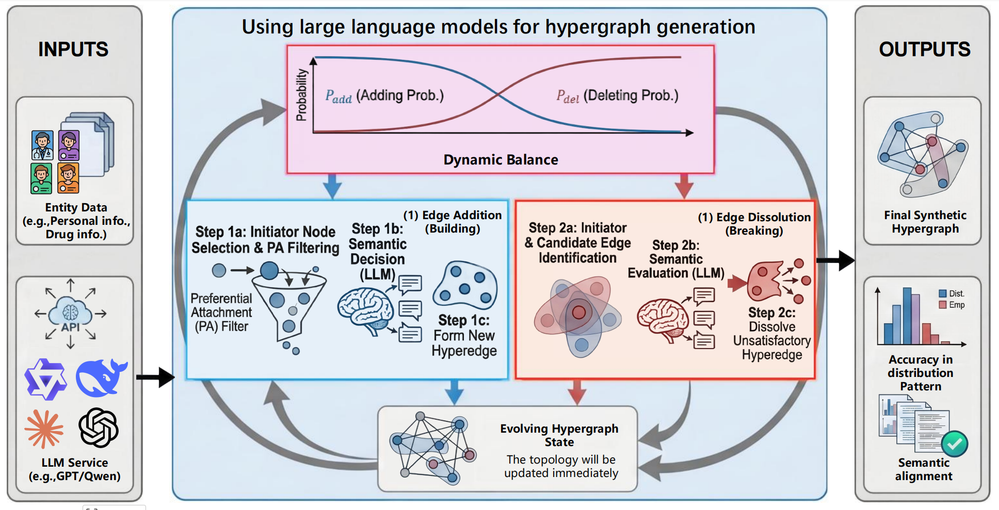
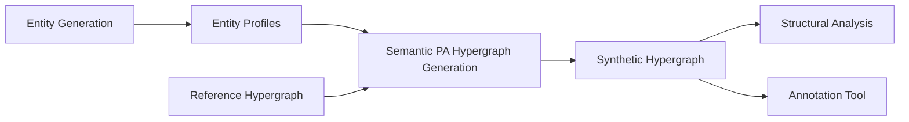

# HyMAGE: Hypergraph Multi-Agent Generation Engine

HyMAGE is an LLM-driven framework for generating realistic synthetic hypergraphs with **Semantic Preferential Attachment (SPA)**. Nodes autonomously propose, join, and dissolve hyperedges through LLM-based semantic decision-making combined with preferential attachment dynamics.

This repository is the official implementation of **HyMAGE: Semantic-Aware Dynamic Hypergraph Generation**.

This repository is organized around the core HyMAGE generation pipeline. It keeps the upstream generation workflow from [anon-researcher-hub/HyMAGE](https://github.com/anon-researcher-hub/HyMAGE) and includes lightweight structural analysis and annotation tools.



## Pipeline



## Key Features

- **Semantic Preferential Attachment**: Nodes form and dissolve hyperedges via LLM-based semantic reasoning.
- **Continuous Evolution Control**: A sigmoid-based controller balances hyperedge addition and dissolution across iterations.
- **Multi-Agent Architecture**: Separate agents handle hyperedge generation and dissolution with node-autonomous decisions.
- **Flexible Entity Support**: Generate personas, drug products, biological reactants, e-commerce entities, or custom entity types.
- **Configurable Candidate Pool**: Use `--candidate_pool_size` to control how many candidate nodes are shown to the LLM during each edge-add decision.
- **Companion Tools**: Use the Flask app for structural analysis and manual or AI-assisted hypergraph annotation.

## Project Structure

```text
HyMAGE/
|-- HyMAGE-Main/              # Core SPA hypergraph generator
|   |-- run.py                # Main entry point
|   |-- agents.py             # Edge generation and dissolution agents
|   |-- evolution.py          # Evolution controller and entity adapter
|   `-- utils.py              # LLM client and utilities
|-- HyMAGE-EntityGen/         # Entity generation utilities
|   |-- entity_generator.py
|   |-- generate_personas_standalone.py
|   |-- augment_personas_algebra.py
|   `-- us_demographics/
|-- HyMAGE-Benchmark/         # Structural analysis and annotation web app
|-- Fig/                      # Pipeline and mechanism figures
|-- .github/workflows/        # Lightweight Python checks
|-- requirements.txt
|-- LICENSE
`-- README.md
```

## Installation

```bash
git clone https://github.com/<your-org-or-user>/HyMAGE.git
cd HyMAGE
python -m venv .venv
source .venv/bin/activate
pip install -r requirements.txt
```

## Dependencies

| Package | Purpose |
| --- | --- |
| `numpy` | Numerical computation |
| `pandas` | Demographic data processing |
| `openai` | OpenAI-compatible LLM client |
| `flask` | Web app for structural analysis and annotation |
| `scipy` | Structural metric computation |
| `matplotlib` | Server-side visualization |

## Quick Start

### 1. Generate Entities

Generate synthetic personas based on US demographic distributions:

```bash
cd HyMAGE-EntityGen
python generate_personas_standalone.py --n 1000 --output personas_1000.json
```

Generate other entity types through an LLM:

```bash
python entity_generator.py \
  --entity_type drug \
  --n 200 \
  --model gpt-3.5-turbo \
  --api_key_file api-key.txt \
  --output drugs_200.json
```

Optionally augment persona profiles with academic attributes:

```bash
python augment_personas_algebra.py \
  --input personas_1000.json \
  --output personas_1000_augmented.json \
  --model gpt-3.5-turbo
```

### 2. Generate a Hypergraph

Run the core SPA generator:

```bash
cd HyMAGE-Main
python run.py \
  --entities ../HyMAGE-EntityGen/personas_1000.json \
  --config path/to/reference_hypergraph.txt \
  --output ./output \
  --model gpt-3.5-turbo \
  --pa_prob 0.7 \
  --candidate_pool_size 15 \
  --max_iterations 100
```

### Generator Arguments

| Argument | Description | Default |
| --- | --- | --- |
| `--entities` | Path to the entity JSON file | required |
| `--config` | Reference hypergraph file used to extract the target edge-size distribution | required |
| `--output` | Output directory or output file path | `./output` |
| `--model` | LLM model name | `gpt-3.5-turbo` |
| `--pa_prob` | Preferential attachment probability, from `0` to `1` | `0.7` |
| `--candidate_pool_size` | Number of candidate nodes shown to the LLM per edge-add decision | `15` |
| `--max_iterations` | Maximum evolution iterations | `100` |
| `--no_analysis` | Suppress detailed reasoning output to reduce token cost | disabled |
| `--semantic` | Semantic preset or custom network description | `None` |
| `--labeled_dataset` | Optional labeled dataset type for hyperedge label prediction | `None` |
| `--base_url` | OpenAI-compatible API base URL | `https://api.openai.com/v1` |

### 3. Run the Structural Analysis and Annotation App

```bash
cd HyMAGE-Benchmark
python app.py
```

Open:

```text
http://localhost:5001
```

The app supports:

- uploading hyperedge `.txt` files and node-profile `.json` files;
- comparing structural metrics against a selected reference hypergraph;
- manually building and annotating hypergraphs;
- optionally using an OpenAI-compatible API to extract annotation metadata.

## Data Format

Hyperedge files use one hyperedge per line:

```text
node1 node2 node3
node2 node5
node4 node7 node8 node9
```

Node profile files use JSON:

```json
{
  "1": {"name": "Alice", "field": "AI"},
  "2": {"name": "Bob", "field": "Systems"}
}
```

## API Key Setup

For OpenAI-compatible models, create an `api-key.txt` file in the working directory or set `OPENAI_API_KEY`:

```text
sk-your-api-key-here
```

You can use `--base_url` to target compatible local or third-party model endpoints.

## Supported LLM Models

- **OpenAI**: `gpt-3.5-turbo`, `gpt-4-turbo`, `gpt-4o`
- **Qwen**: `qwen2.5-3b`, `qwen2.5-7b` through compatible API endpoints

## Citation

If this implementation or the HyMAGE framework is useful for your research, please cite our paper:

```bibtex
@inproceedings{
Gu2026hymage,
title={Hy{MAGE}: Semantic-Aware Dynamic Hypergraph Generation},
author={Bingqiao Gu, Jiale Zeng, Nuoran Zhou, Xingqin Qi, Dong Li},
booktitle={32nd SIGKDD Conference on Knowledge Discovery and Data Mining, 2026 - Research Track (Second Cycle Deadline)},
year={2026}
}
```

## License

This project is released under the MIT License. See `LICENSE`.
